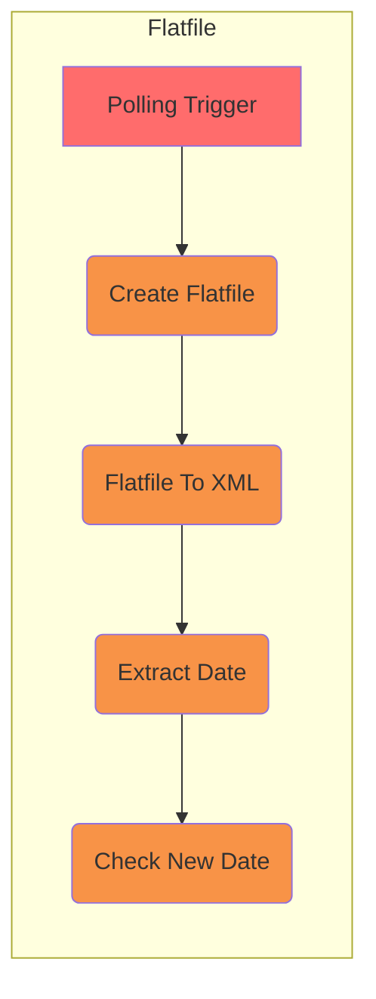

# Flatfile Testing

Project tests interlok-flatfile features

## What it does

This project is very simple and contains only one single channel with one workflow.

The workflow has a polling trigger that produces a message then an embedded scripting service create a flat file payliad and a date metadata every 10 seconds.
Then a service convert the flat file payload to an XML payload, then a Xpath service extract the date from the XML and add it to a metadata.
Finally a If service check if the new date equals the original one and throws an exception if it doesn't.



The Embedded Scripting Service creates the flat file message and add the date metadata.
The date is made up from "202101" plus a random number bewteen 1 and 10 for the day. The date is not added as a metadata when the day value is 9 to simulate some sporadic failures.

## Example

The flat file service converts a file like:

```
HDRSRC20110601THE TITLE OF DOCSrcDescDestinationDesc  1234567890  
DETField   1.01Field  1.02Field     1.0320110601Field   1.04400821
TRL00000005                                                       
```

To an XML like:

```xml
<?xml version="1.0" encoding="iso-8859-1"?>
<root>
	<segment_Document>
		<segment_Header>
			<record_HDR>
				<RecordType>HDR</RecordType>
				<SourceCode>SRC</SourceCode>
				<RunDate>20110601</RunDate>
				<Title>THE TITLE OF DOC</Title>
				<SourceDescription>SrcDesc</SourceDescription>
				<DestDescription>DestinationDesc</DestDescription>
				<Filler>1234567890</Filler>
			</record_HDR>
		</segment_Header>
		<segment_Details>
			<record_DET>
				<RecordType>DET</RecordType>
				<FieldOne>Field 1.01</FieldOne>
				<FieldTwo>Field 1.02</FieldTwo>
				<FieldThree>Field 1.03</FieldThree>
				<CompletionDate>20110601</CompletionDate>
				<FieldFour>Field 1.04</FieldFour>
				<Filler>400821</Filler>
			</record_DET>
		</segment_Details>
		<segment_Trailer>
			<record_TRL>
				<RecordType>TRL</RecordType>
				<Total>00000005</Total>
				<Filler/>
			</record_TRL>
		</segment_Trailer>
	</segment_Document>
</root>

```

## Getting started

* `./gradlew clean build`
* `(cd ./build/distribution && java -jar lib/interlok-boot.jar)`


The config is using a variables.properties to configure the flatfile definition url.

```
ffDefinitionUrl=file://localhost/./config/transform/flatfile.definition.xml
```
